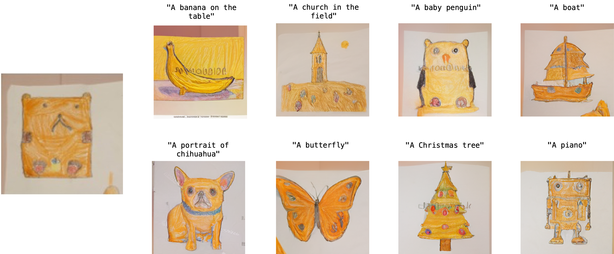

# StyleDrop

<p align="left">
  <a href="https://huggingface.co/spaces/zideliu/styledrop"></a>
</p>


This is an unofficial PyTorch implementation of [StyleDrop: Text-to-Image Generation in Any Style](https://arxiv.org/abs/2306.00983).


Unlike the parameters in the paper in (Round 1), we set $\lambda_A=2.0$, $\lambda_B=5.0$ and `d_prj=32`, `is_shared=False`, which we found work better, these hyperparameters can be seen in `configs/custom.py`.

we release them to facilitate community research.


<br/><br/>

<br/><br/>

<br/><br/>

<br/><br/>


## News
- [07/06/2023] Online Gradio Demo is available [here](https://huggingface.co/spaces/zideliu/styledrop)

## Todo List
- [x] Release the code.
- [x] Add gradio inference demo (runs in local).
- [ ] Add iterative training (Round 2).

## Data & Weights Preparation
First, download VQGAN from this [link](https://drive.google.com/file/d/13S_unB87n6KKuuMdyMnyExW0G1kplTbP/view) (from [MAGE](https://github.com/LTH14/mage), thanks!), and put the downloaded VQGAN in `assets/vqgan_jax_strongaug.ckpt`.

Then, download the pre-trained checkpoints from this [link](https://huggingface.co/nzl-thu/MUSE/tree/main/assets/ckpts) to `assets/ckpts` for evaluation or to continue training for more iterations.

finally, prepare empty_feature by runnig command `python extract_empty_feature.py`

And the final directory structure is as follows:
```
.
├── assets
│   ├── ckpts
│   │   ├── cc3m-285000.ckpt
│   │   │   ├── lr_scheduler.pth
│   │   │   ├── nnet_ema.pth
│   │   │   ├── nnet.pth
│   │   │   ├── optimizer.pth
│   │   │   └── step.pth
│   │   └── imagenet256-450000.ckpt
│   │       ├── lr_scheduler.pth
│   │       ├── nnet_ema.pth
│   │       ├── nnet.pth
│   │       ├── optimizer.pth
│   │       └── step.pth
│   ├── fid_stats
│   │   ├── fid_stats_cc3m_val.npz
│   │   └── fid_stats_imagenet256_guided_diffusion.npz
│   ├── pipeline.png
|   ├── contexts
│   │   └── empty_context.npy
└── └── vqgan_jax_strongaug.ckpt

```


## Dependencies
Same as [MUSE-PyTorch](https://github.com/baaivision/MUSE-Pytorch).
```
conda install pytorch torchvision torchaudio cudatoolkit=11.3
pip install accelerate==0.12.0 absl-py ml_collections einops wandb ftfy==6.1.1 transformers==4.23.1 loguru webdataset==0.2.5 gradio
```

## Train
All style data in the paper are placed in the data directory

1. Modify `data/one_style.json` (It should be noted that `one_style.json` and `style data` must be in the same directory), The format is `file_name:[object,style]`

```json
{"image_03_05.jpg":["A bear","in kid crayon drawing style"]}
```
2. Training script as follows.
```shell
#!/bin/bash
unset EVAL_CKPT
unset ADAPTER
export OUTPUT_DIR="output_dir/for/this/experiment"
accelerate launch --num_processes 8 --mixed_precision fp16 train_t2i_custom_v2.py --config=configs/custom.py
```


## Inference

The pretrained style_adapter weights can be downloaded from [🤗 Hugging Face](https://huggingface.co/zideliu/StyleDrop/tree/main).
```shell
#!/bin/bash
export EVAL_CKPT="assets/ckpts/cc3m-285000.ckpt" 
export ADAPTER="path/to/your/style_adapter"

export OUTPUT_DIR="output/for/this/experiment"

accelerate launch --num_processes 8 --mixed_precision fp16 train_t2i_custom_v2.py --config=configs/custom.py
```


## Gradio Demo
Put the [style_adapter weights](https://huggingface.co/zideliu/StyleDrop/tree/main) in `./style_adapter` folder and run the following command will launch the demo:

```shell
python gradio_demo.py
```

The demo is also hosted on [HuggingFace](https://huggingface.co/spaces/zideliu/styledrop).

## Citation
```bibtex
@article{sohn2023styledrop,
  title={StyleDrop: Text-to-Image Generation in Any Style},
  author={Sohn, Kihyuk and Ruiz, Nataniel and Lee, Kimin and Chin, Daniel Castro and Blok, Irina and Chang, Huiwen and Barber, Jarred and Jiang, Lu and Entis, Glenn and Li, Yuanzhen and others},
  journal={arXiv preprint arXiv:2306.00983},
  year={2023}
}
```


## Acknowlegment

* The implementation is based on [MUSE-PyTorch](https://github.com/baaivision/MUSE-Pytorch)
* Many thanks for the generous help from [Zanlin Ni](https://github.com/nzl-thu)

## Star History


